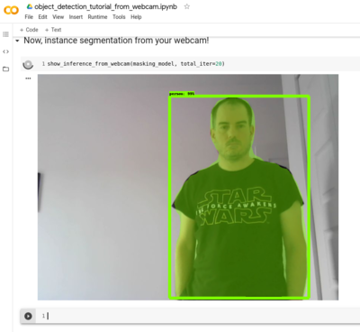

# colab_utils
Some useful (or not so much) Python stuff for Google Colab notebooks


## How to install it:
Click on a code cell and paste:
```
!pip install git+git://github.com/ricardodeazambuja/colab_utils.git
```
Then `alt+enter` or `shift+enter` to execute. 

## Examples
- [Notebook with examples of each function](Testing_colab_utils.ipynb).
- [Object Detection and Segmentation, kind of real-time, directly from your webcam](object_detection_tutorial_from_webcam.ipynb).

And here is the output while the [segmentation](object_detection_tutorial_from_webcam.ipynb) was running on colab getting images from my webcam (live):   
  
*And before anyone asks, yes, I wear Star Wars pijamas... only during quarantine ;)

## TODO
Improve the code because right now it's a mess, as non-optimal as it gets, but it works and it's cool to do stuff directly using Google Colab ;)

## Other projects you may like to check:
* [ExecThatCell](https://github.com/ricardodeazambuja/ExecThatCell): (Re)Execute a Jupyter (colab) notebook cell programmatically by searching for its label.
* [Maple-Syrup-Pi-Camera](https://github.com/ricardodeazambuja/Maple-Syrup-Pi-Camera): Low power('ish) AIoT smart camera (3D printed) based on the Raspberry Pi Zero W and Google Coral EdgeTPU
* [The CogniFly Project](https://github.com/thecognifly): Open-source autonomous flying robots robust to collisions and smart enough to do something interesting!
* [Bee](https://github.com/ricardodeazambuja/Bee): The Bee simulator is an open source Spiking Neural Network (SNN) simulator, freely available, specialised in Liquid State Machine (LSM) systems with its core functions fully implemented in C.
